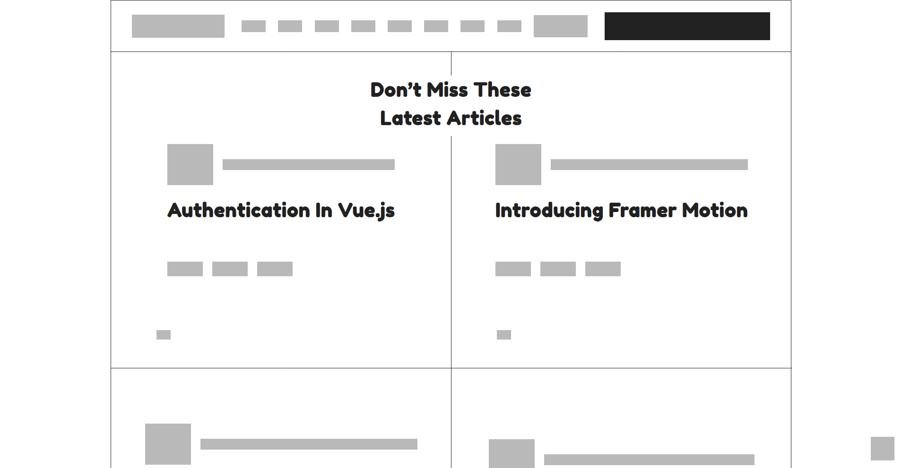

# Smashing Magazine Heatmap

> The goal for this exercise was to start training ourselves to think in terms of visual hierarchy, typography and design principles. We had to create a grayscale heat map of the [Smashing Magazine website](https://www.smashingmagazine.com/#top) that indicated which elements have the greatest weight in the visual hierarchy. This project also served us an opportunity to get better at positioning div elements without worrying about the content inside.



## Built With

- HTML5
- CSS3
- *other resources:*
  - [normalize.css](https://necolas.github.io/normalize.css/)
  - [Google Fonts](https://fonts.google.com/)
    - [Fredoka One](https://fonts.google.com/specimen/Fredoka+One?category=Display)
    - [Noto Sans](https://fonts.google.com/specimen/Noto+Sans?category=Sans+Serif,Display&query=google)

## Live Demo

[Live Demo Link](https://antonyotero.github.io/smashing-heatmap/)

## Getting Started

To get a local copy up and running follow these simple example steps.

### Prerequisites

- [Visual Studio Code](https://code.visualstudio.com/)
- [Live Server plugin](https://marketplace.visualstudio.com/items?itemName=ritwickdey.LiveServer) for Visual Studio Code 

### Setup

1- Clone the repository
```
git clone https://github.com/elberthcorniell/Youtube-Clone.git
```

2- Open the cloned repo directory in VS Code, right click the index.html file and click on "Open With Live Server"

3- Everything should be running by now. 👍

## Authors

👤 **Author1**

- GitHub: [@githubhandle](https://github.com/githubhandle)
- Twitter: [@twitterhandle](https://twitter.com/twitterhandle)
- LinkedIn: [LinkedIn](https://linkedin.com/linkedinhandle)

👤 **Antony Otero**

- GitHub: [@AntonyOtero](https://github.com/AntonyOtero)
- Twitter: [@AntonyOtero](https://twitter.com/AntonyOtero)
- LinkedIn: [antonyotero](https://www.linkedin.com/in/antonyotero/)

## 🤝 Contributing

Contributions, issues, and feature requests are welcome!

Feel free to check the [issues page ](https://github.com/AntonyOtero/smashing-heatmap/issues).

## Show your support

Give a ⭐️ if you like this project!

## Acknowledgments

- [@microverseinc](https://github.com/microverseinc)

## 📝 License

This project is [MIT](LICENSE) licensed.
